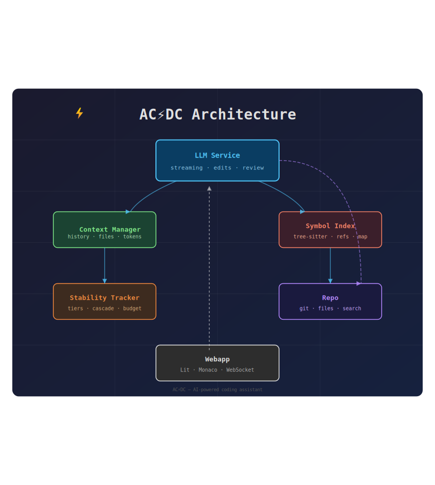

# Preview Test

This file tests image rendering and math rendering in the diff viewer's markdown preview mode.

## SVG Image (Relative Path)



## With Alt Text

Here is the architecture diagram:


Some text after the image.

## Inline Text Around Images

Text before the image  and text after it.

## Non-Existent Image

This image should degrade gracefully:


Text continues after the missing image.

## External URL (Should Pass Through)


## Heading After Images

This section verifies that headings render correctly after image elements.

## Math Rendering

### Inline Math

The quadratic formula gives $x = \frac{-b \pm \sqrt{b^2 - 4ac}}{2a}$ for any quadratic $ax^2 + bx + c = 0$.

Greek letters: $\alpha$, $\beta$, $\gamma$, $\Delta$, $\Omega$.

### Display Math

$$
\int_{-\infty}^{\infty} e^{-x^2} dx = \sqrt{\pi}
$$

### Multiple Equations

$$
E = mc^2
$$

$$
F = ma
$$

### Fractions and Subscripts

$$
H(z) = \frac{Y(z)}{X(z)} = \frac{b_0 + b_1 z^{-1}}{a_0 + a_1 z^{-1}}
$$

### Summations and Products

$$
\sum_{n=1}^{\infty} \frac{1}{n^2} = \frac{\pi^2}{6}
$$

$$
\prod_{i=1}^{n} x_i = x_1 \cdot x_2 \cdots x_n
$$

### Matrices

$$
\begin{pmatrix} a & b \\ c & d \end{pmatrix} \begin{pmatrix} x \\ y \end{pmatrix} = \begin{pmatrix} ax + by \\ cx + dy \end{pmatrix}
$$

## Code Blocks

```python
def quadratic(a, b, c):
    """Solve ax^2 + bx + c = 0."""
    discriminant = b**2 - 4*a*c
    return (-b + discriminant**0.5) / (2*a)
```

```javascript
function fibonacci(n) {
  if (n <= 1) return n;
  return fibonacci(n - 1) + fibonacci(n - 2);
}
```

## Tables

| Operator | Symbol | Example |
|----------|--------|---------|
| Sum | $\sum$ | $\sum_{i=1}^n i$ |
| Product | $\prod$ | $\prod_{i=1}^n i$ |
| Integral | $\int$ | $\int_0^1 x\,dx$ |

## Blockquotes

> Mathematics is the queen of the sciences.
> — Carl Friedrich Gauss

## Links

- [Relative link to sample SVG](sample.svg)
- [External link](https://example.com)
- [Anchor link](#math-rendering)

## Nested Lists

- Item 1
  - Sub-item with $\alpha$
  - Sub-item with $\beta$
- Item 2
  1. Ordered sub-item
  2. Another with $\gamma = \alpha + \beta$